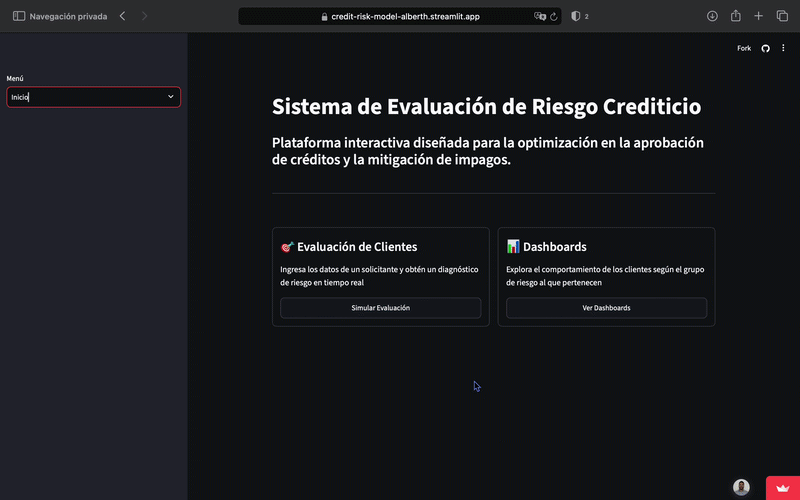

# Sistema de Evaluación de Riesgo Crediticio


[🚀 Ver App en Vivo](https://credit-risk-model-alberth.streamlit.app/) | [🐳 Docker Hub](https://hub.docker.com/r/alberthpb99/credit_risk_app)

Plataforma interactiva end-to-end diseñada para la optimización en la aprobación de créditos y mitigación del riesgo de impago en entidades financieras.

---

## 1. Problema de Negocio e Impacto

El otorgamiento de créditos a perfiles con alta probabilidad de incumplimiento genera pérdidas significativas para las entidades financieras. Este proyecto desarrolla un sistema predictivo capaz de anticipar el riesgo de impago a partir de datos sociodemográficos y financieros.

**Impacto clave del modelo (XGBoost):**
* 🎯 **71% de identificación** en clientes de alto riesgo de impago (mitigación directa de pérdidas).
* ✅ **84% de precisión** en la clasificación de perfiles seguros (optimización del proceso de aprobación).

---

## 2. Demostración de la Aplicación

La aplicación en Streamlit permite realizar evaluaciones en tiempo real y explorar la distribución de los datos.

<p align="center">
  
</p>

---

## 3. Tecnologías Utilizadas

* **Lenguaje:** Python
* **Análisis y ML:** Pandas, NumPy, Scikit-Learn, XGBoost, Joblib
* **Visualización:** Plotly / Matplotlib / Seaborn
* **Frontend:** Streamlit
* **Despliegue & MLOps:** Docker, Docker Hub, Streamlit Cloud

---

## 4. Estructura del Repositorio

```text
credit-risk/
│
├── data/
│   ├── raw.csv                # Datos crudos 
│   └── processed.csv          # Datos limpios (generados por el archivo cleaning.py)
│
├── media/                     
│   └── demo.gif               # GIF de demostración de la app
│
├── models/
│   └── model_pipeline.joblib  # Pipeline de preprocesamiento + Modelo XGBoost entrenado (Generado por el archivo train.py)
│
├── notebooks/
│   ├── 01_eda.ipynb           # Análisis Exploratorio de Datos (EDA)
│   └── 02_modeling.ipynb      # Experimentación y selección de modelos
│
├── src/
│   ├── __init__.py
│   ├── cleaning.py            # Funciones de limpieza
│   └── train.py               # Script de entrenamiento y guardado del pipeline
│
├── Dockerfile                 # Configuración del contenedor Docker
├── Reporte.pdf                # Reporte el EDA y el modelamiento con resultados y conclusiones
├── app.py                     # Aplicación principal de Streamlit
└── requirements.txt           # Dependencias del proyecto
